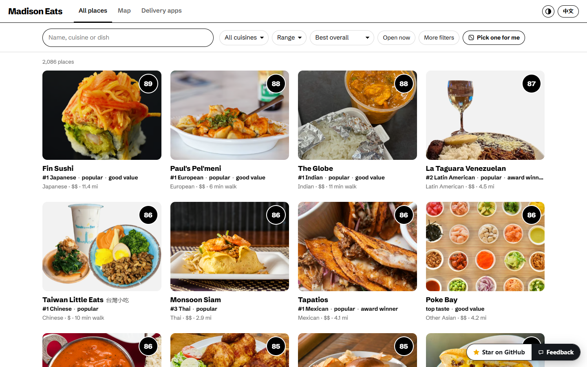
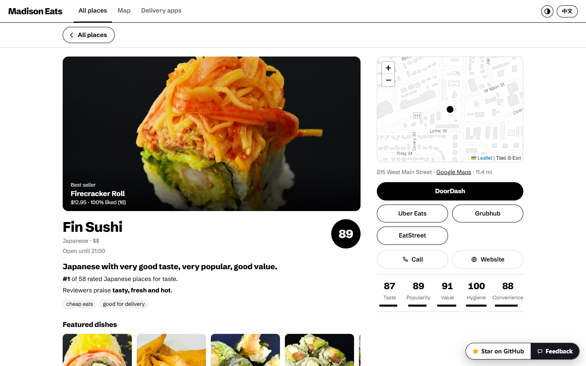
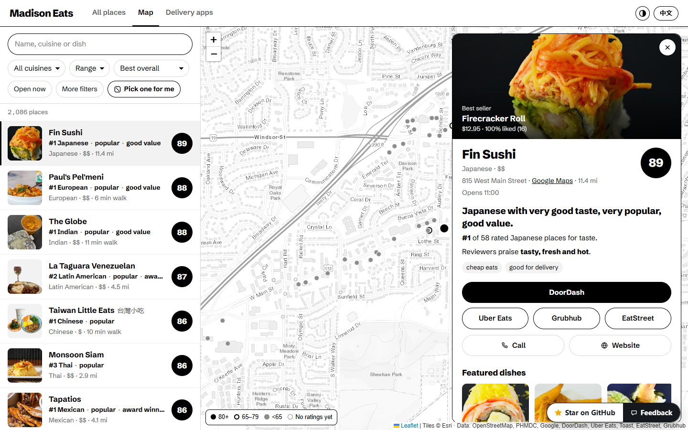
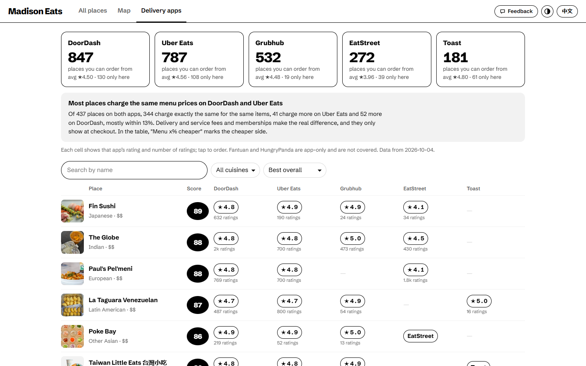

# Madison Food Map

Every place to eat in Madison and the rest of Dane County, WI on one map, scored from six rating sources, with which delivery apps carry each one.

**Open it: https://webgrs.github.io/madison-food-map/**

## What you can do

- Browse **2,292 places** as photo cards across the whole screen, or on a map with a list beside it: restaurants, fast food, cafés, bakeries and dessert shops, bars, food carts, grocery stores, UW-Madison campus dining, and 87 delivery-only brands. Places that look closed or replaced are hidden unless you search for them by name.
- Search in English or Chinese ("ramen", "dumpling", "拉面", "火锅"), filter by type, cuisine (tick as many as you like), delivery app, open now and occasion (late night, cheap eats, date, groups, quick bite, delivery, brunch), and sort by overall score, taste, popularity, value, hygiene, distance or number of ratings. A Range filter keeps places within a distance (from campus, the Capitol or your location) and a score band. Can't decide? "Pick one for me" draws one place at random from whatever the filters and range allow, with the same range sliders right in the dialog.
- Every place in the list shows up to three highlights: its rank within its cuisine, very good taste, popularity, value, an award, or a caution such as a weak inspection record or reports that it closed.
- Open a place for its own page: photos of its most-ordered dishes and, right under the name, the verdict (warnings first, then one line on taste, popularity and value, its rank in its cuisine and what reviewers praise or complain about); beside it, a small map of where it is, the address, where to order and its five scores. Ratings from each source, opening hours and Public Health inspection results are folded below.
- A button in the header switches between black on white and white on black.
- The **Delivery apps** tab compares DoorDash, Uber Eats, Grubhub, EatStreet and Toast: how many places each one carries, their average rating, and how many places only that app has. Below that, every orderable place is listed with its rating and number of ratings on each app, and each cell opens that store page. 1,160 places can be ordered on at least one app: DoorDash 859, Uber Eats 817, Grubhub 539, EatStreet 274, Toast 182. A price check compares the same menu items on DoorDash and Uber Eats: at 79% of the 438 places it could check, they cost exactly the same, so the difference between the apps is in the fees.

## How the scores work

| Score | Weight | Built from |
|---|---|---|
| Taste | 50% | star ratings from Google, DoorDash, Uber Eats, Toast, EatStreet and Grubhub, each turned into a percentile among Madison places on the same app; words about taste in delivery reviews; tone of r/madisonwi discussion; Best of Madison and James Beard recognition |
| Popularity | 15% | number of ratings, r/madisonwi mentions, awards |
| Value | 15% | taste and how cheap the typical main dish is compared with places of the same cuisine |
| Hygiene | 10% | Public Health Madison & Dane County inspections in the last three years |
| Convenience | 10% | delivery apps, late hours, open seven days |

Few ratings pull a score toward the middle, and a place rated on only one app is pulled further. Sources count more when they agree with the others. Scores are relative to other places in the area, so 50 is roughly the median. Checked against signals that were not used to build them, award winners outrank other places 66% of the time even with the award bonus removed.

## Data

Collected in October 2026 from: Public Health Madison & Dane County food licences and inspection reports; OpenStreetMap (© OpenStreetMap contributors, ODbL); Google Maps, DoorDash, Uber Eats, Toast, EatStreet and Grubhub public store pages; r/madisonwi via the Arctic Shift archive; Madison Magazine's Best of Madison 2024–2025; James Beard Foundation semifinalists 2025–2026; UW Housing and Wisconsin Union dining pages. Map tiles by Esri.

Ratings are snapshots and belong to the services that publish them; follow the links for current figures. Review text is not republished here. Dish and storefront photos are the menu photos on the delivery apps' store pages and load from their servers. Fantuan and HungryPanda are app-only and are not covered.

## How the data is served

This repository holds the page only (`index.html`, `app.js`, `style.css`, `guard-client.js`, and `feedback.js`, the Feedback button that sends a note to the owner's inbox). The dataset is not in it: a Cloudflare Worker answers the page one list page or one place at a time (`/api/search`, `/api/place`, `/api/plat`, `/api/peek`), and no endpoint returns everything at once. Every data request needs a session token that the page gets after an invisible Cloudflare Turnstile check, requests must come from this site, each client is rate-limited per minute, and each visitor and each network has a daily allowance counted in records. Requests are logged anonymously (the place opened and the filters used, with only a one-way hash of the IP address and never the location used for distances) so bulk copying shows up and can be blocked. That raises the cost of copying everything; it cannot make copying impossible, because anything the page shows a patient scraper can read too.

Built on 2026-10-07.
